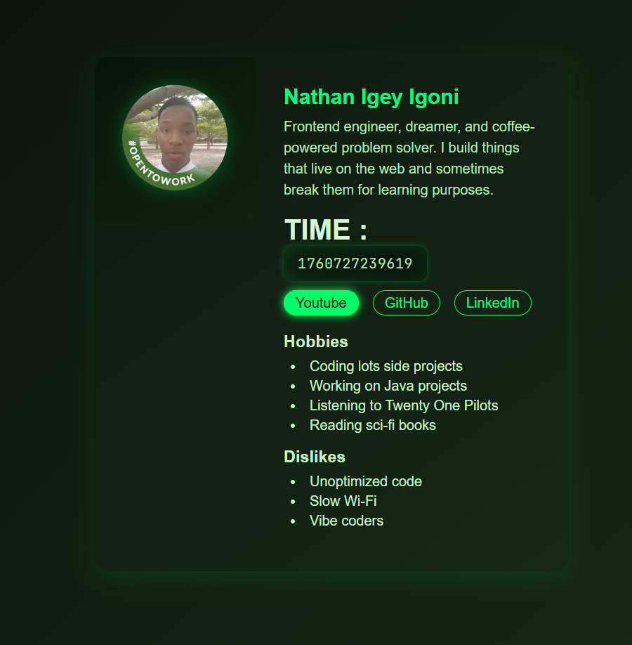

# 🌐 Profile Card UI

A responsive, modern, and neon-styled **Profile Card** built with clean HTML and CSS.  
It features a sleek layout, subtle glow effects, and a fully responsive design that adjusts beautifully across devices.



---

## 🚀 Features

- 💡 **Modern design** — Clean and minimal with soft neon tones (not over-the-top “TRON” vibes).  
- 📱 **Responsive layout** — Works seamlessly across desktops, tablets, and mobile screens.  
- 👤 **Profile structure** — Includes profile picture, name, role, bio, and time/date display.  
- 🎨 **Customizable theme** — Easy to tweak colors, gradients, and fonts.  
- ⚡ **Lightweight** — Built with pure HTML and CSS, no external dependencies.

---

## 🧰 Tech Stack

- HTML5  
- CSS3 (Flexbox + responsive design)  
- Google Fonts (modern sans-serif font styling)

---

## 🧩 Folder Structure

```bash
profile-card/
│
├── assets/               # Images, icons, or font files
├── styles/               # CSS stylesheets
│   └── style.css
├── index.html            # Main entry file
└── README.md             # Project documentation
```
🧠 How to Run Locally

You can clone and run this project easily in any local environment.

1. Clone the repository
git clone https://github.com/Nathanigoni/ProfileCard.git

2. Navigate to the project folder
cd profile-card

3. Open in your browser

You can simply double-click index.html, or use the Live Server extension in VS Code:

# If using VS Code:
Right click → "Open with Live Server"

💬 Author

Nathan Igey Igoni
GitHub: @Nathanigoni

Email: usnow02@gmail.com
